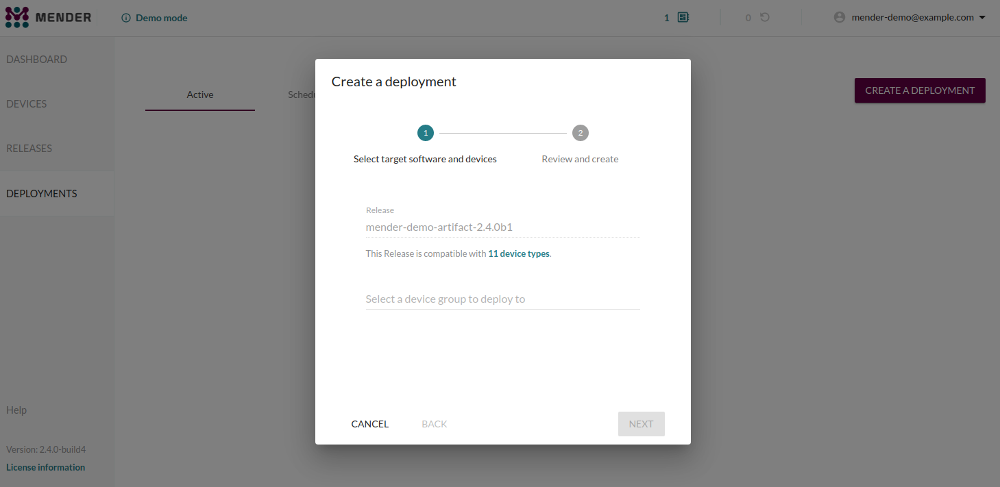

Quickly and easily deploy your first over-the-air (OTA) software update with Mender using a secure server we host for you. We will take you through installing Mender and deploying a simple* application* *update* on your Raspberry Pi and Raspbian OS.

## What you will need

To follow this guide, you will need the following:

* A [Raspberry Pi 3 Model B](https://www.raspberrypi.org/products/raspberry-pi-3-model-b?target=_blank) or [B+](https://www.raspberrypi.org/products/raspberry-pi-3-model-b-plus?target=_blank), or a [Raspberry Pi 4 Model B](https://www.raspberrypi.org/products/raspberry-pi-4-model-b?target=_blank).
* An 8 GB or larger microSD card.
* A Raspberry Pi [universal power supply](https://www.raspberrypi.org/products/raspberry-pi-universal-power-supply?target=_blank) or a micro USB cable.
* An ethernet cable for wired connectivity to the internet (optional).
* A Mender Professional account to access the hosted server.

### Get a Mender Professional account

Get a Mender account by [signing up here](https://mender.io/signup?target=_blank).

!!! We provide $120 free credit for you to use for evaluation. You can cancel at any time without incurring a cost while your usage remains under $120.

You can also try it on-premise, but it requires more effort getting setup. See the [on-premise instructions below](#running-mender-on-premise).

### Prep your device

Make sure your Raspberry Pi has Raspbian OS installed. 

* Download Raspbian OS image from [here](https://www.raspberrypi.org/downloads/raspbian?target=_blank).
* [Follow their steps](https://www.raspberrypi.org/documentation/installation/installing-images?target=_blank) to install the OS image to your device and [enable SSH](https://www.raspberrypi.org/documentation/remote-access/ssh/README.md?target=_blank) on your board. This should take less than 15 minutes.

Let’s get you on your way to your first deployment in as easy as 5 short steps:

### Step 1 - SSH into your Raspberry Pi device 

SSH into your device:

```bash
ssh pi@<DEVICE-IP-ADDRESS>
```

You should now see a command prompt similar to the following:

```bash
pi@raspberrypi:~ $
```

Keep this terminal open as we will shortly use it to install the Mender client.


### Step 2 - Login to Mender Professional

Login to your [Mender Professional account](https://hosted.mender.io/ui/#/login?target=_blank), and when on the main page for the first time new users will get a tutorial in the Mender web GUI.

Go to the **Dashboard** tab and click on **Connect a device**. Then Click on **Connect my own device**. Select your Raspberry Pi model and click **Next**. You should see a screen similar to the below.


### Step 3 - Install Mender client on your device 

Next we will install the Mender client on your device so that it can talk to the Mender server.

In the dialog box from Step 2, click **Copy to clipboard** to copy the code to install the Mender client. Now go to the command line on your device from step 1, and **paste** the code e.g. by right-clicking in the terminal and selecting *Paste*, followed by *Enter*.

This downloads the Mender client on the device, configures and starts it.

Once the client has started, your the Mender client will attempt to connect to the server and it will appear in your Pending devices tab in the server. Go ahead and **Accept** the pending device in the server. After accepting the device, it will appear on the Devices group tab on the left of Pending. 


### Step 4 - Create a Deployment 

There is already a mender-demo Artifact available under *Releases* the first time you use Mender. It contains a small web server your device can run.

Go to the **Deployments** tab and select the target release already available and click **Create deployment** as shown below.



After about 30 seconds you see your finished deployment in the *Finished* tab. There should also be a tooltip to the URL of your deployed web server.


Once you access your device using the URL shown in the tooltip under the *Finished* tab you should see a welcome page similar to the following.


**Congratulations!** You have successfully deployed an application update using Mender!


### Step 5 - Modify the application

The onboarding tooltips should now take you through modifying the web page you saw in step 4, using tools to generate Mender Artifact (.mender) files.
Simply follow the tooltips to update your newly deployed application!


## Running Mender on-premise

For the easiest and fastest experience, we recommend using the hosted version of Mender for your first evaluation. You can also try the same deployment above using the on-premise version by installing a Mender demo server on a host machine, however this will take you a bit longer. You will need to install [Docker Engine](https://docs.docker.com/install/linux/docker-ce/ubuntu?target=_blank) (on device) and [Docker Compose](https://docs.docker.com/compose/install?target=_blank) in your deployment environment. 

Next, you will need to download the Mender integration environment in the working directory:

<!--AUTOVERSION: "-b % https://github.com/mendersoftware/integration.git"/integration-->
```
git clone -b 2.2.0 https://github.com/mendersoftware/integration.git integration

cd integration
```

And finally fire up the demo server environment with:

```
./demo up
```

Note that the demo up script starts the Mender services, adds a demo user with the username mender-demo@example.com, and assigns a random password in which you can change after you log in to the Mender web UI. The Mender UI can be found on [https://localhost](https://localhost?target=_blank).

After you log into the UI on the ‘localhost’ you can follow steps 1 through 5 listed above. 

## Have any questions? 

If you need help and have any questions:

* Visit our community forum at [Mender Hub](https://hub.mender.io/) dedicated to OTA updates where you can discuss any issues you may be having. Share and learn from other Mender users.

* Learn more about Mender by reading the rest of the documentation. 

[Compare plans](https://mender.io/products/pricing?target=_blank) and choose a plan that fits your requirements. 

