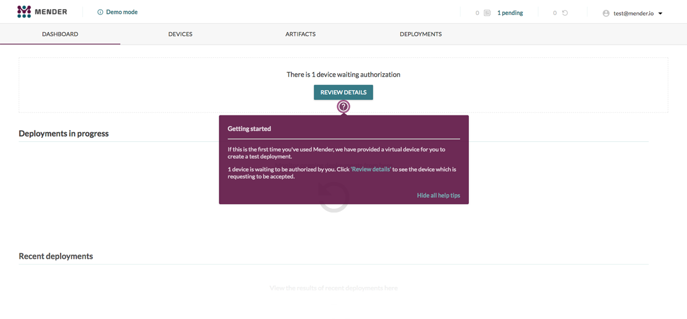

In this tutorial we will show how to use the intuitive Mender server UI
to deploy a full rootfs image update to a virtual device which is
connected to the server. The virtual device is bundled with the
Mender server to make it easy to test Mender.

## Prerequisites

The test environment should be set up and working successfully
as described in [Install a Mender demo server](../create-a-test-environment) and you should have downloaded the virtual Artifacts listed in [Download demo images](../download-test-images).

## Open the Mender UI

Open the Mender UI by navigating to [https://localhost/](https://localhost/?target=_blank) in the same browser as you accepted the certificate
in as part of [Install a Mender demo server](../create-a-test-environment).

After a minute or two, there should be a virtual device that is pending authorization:

__Follow the help tooltips__ in the UI to guide you through each step of deploying to your virtual device - authorizing the device, viewing information about it, uploading an Artifact file, and finally deploying your very first update to the device.

!!! If you don't see the help tooltips, there is an option to toggle them on/off from the dropdown at your user email up at the top right corner of the screen.

### Additional information

! There are security implications to connecting a client and server for the first time, also known as *bootstrapping*. If a client and server have not exchanged any information in advance, they need to accept each other on trust this first time, with the risk that the information the other party presents is spoofed. To mitigate this risk, the Mender client preinstalls the TLS certificate of the server when it is provisioned, as part of the Yocto Project image build. So it is not possible for a rogue server to intercept the connection from a client or pretend to be a different server, assuming server's private TLS key is securely managed. A rogue device can still spoof the information it sends to the server in order to be authorized, and this is why Mender asks you to make the authorization decision. However, the risk of letting the server manage a rogue device is much lower than the risk of a rogue server managing devices.

!!! The console of the virtual device can be seen by running `docker logs $(docker ps | grep mender-client | cut -f1 -d' ')`.

## Deploying to physical devices

**Congratulations!** If you followed the help tips successfully, you have used the Mender server to deploy your first managed update!
If you have a Raspberry Pi 3 or BeagleBone Black, you can proceed to
[Deploy to physical devices](../deploy-to-physical-devices) to try out deploying to a
real-world device.
