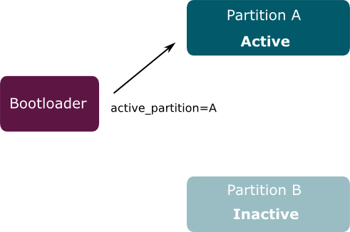
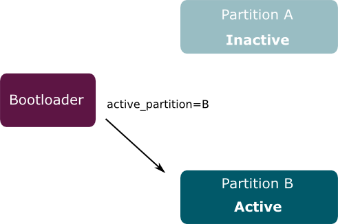

The high-level flow of data when deploying OTA software updates is shown in the
diagram below.

First the **software build system** generates a new version of the distributed
software for the device.

To begin the process, the **software build system** generates a new version of
the device software for the device. It is responsible for creating an image for
your device(s), and simplifies tasks such as cross-compiling and packaging the
image into the distribution format required by the device. Embedded Linux has
some well known build systems such as the [Yocto
Project](https://www.yoctoproject.org/) and [Buildroot](https://buildroot.org/).

Next, the **build Artifacts** are uploaded to the Mender **Management Server**.
The responsibility of which is to deploy the updates to the selected devices at
the selected time, and in the selected order, as well as keeping track of the
currently installed software, and hardware statistics of each device.

The **Device** runs a daemon (the Mender client), which periodically polls the
**Management Server** for updates, and uploads the software and hardware
information the server requires. If the server reports that an update is
available, the client is then responsible for downloading and installing it
safely on the device - even in the face of unforseen circumstances, such as a
power loss, or user interference.

## Modes of operation

### **Managed mode** 

Managed mode is the most common way to use the Mender client and is enabled by
default. When running Mender in managed mode, the Mender client runs as a daemon
and will regularly poll the server, automatically apply updates, reboot, report
and commit the update. All of these actions can be further customized through
the [state-script](../State-scripts) extensions available in the client. This is
the best way to run Mender for most large-scale deployments, as the deployments
are centrally managed across many devices.

### **Standalone mode**

 Standalone mode gives the opportunity to manually run the Mender client from
 the CLI, as opposed to having a daemon running in the background. This is
 useful, for instance, if the client has no network connectivity, or if you are
 going to manually update from a USB stick, or other forms of removable memory.
 It is also used by some customers to manage a custom workflow on the device, so
 that the updates can be controlled explicitly.

1. Downloading and writing the update to the passive partition through `mender
-install <URL|file://local-artifact>`
2. Reboot into the passive partition which now holds the new software install
through the system's `reboot` command.
3. If the newly updated software meets all the expected criteria, mark the new
update as persistent through `mender -commit`.

The Mender client is implicitly running in standalone mode when it is not
running as a daemon. To achieve this simply update the systemd service. If you
are using Yocto Project, you can follow [disabling Mender as a system service in
Yocto Project](TODO) to enable standalone mode. To read more about standalone
mode, have a look at the [documentation](../09.Standalone-deployment).

## Types of Artifacts

### **rootfs-image payload (full system updates)** 

Rootfs-image Artifacts contain a rootfs image payload, ready to be written to
the passive partition during a full system update. This is the standard update
flow for Mender enabled devices, and is the safest, and most robust way of doing
software updates. This takes advantage of the dual partition scheme to make sure
that the device will recover, in case of an error during the update process, or
in the case of faulty software.

### **Update Module payload (partial system updates)**

Update module Artifacts can contain custom update payloads, such as application
updates, single files or scripts to be run on the device. Many update modules
have [already been created and
shared](https://hub.mender.io/c/update-modules/13) by the Mender community.
These include use-cases such as:

* Updating the rootfs file system using delta updates
* Updating a Docker container
* Updating a directory
* Running a script
* Updating Device Firmware
* Updating a single file
* Updating packages, such as deb or rpm

And best of all, it is possible to write your own custom update modules to fit
your exact use case. For more information have a look at the [update
module](../07.Mender-Update-Module) section of the documentation.

A full description of the Mender Artfiact format can be found here: [Mender
Artifacts](../06.Mender-Artifact).

## Robust updates

Providing a robust update mechanism implies that the targeted device can be
recovered in the case of issues during the update process. These events include
things like: loss of power, or an unstable power-supply, unstable, or complete
loss of network connectivity. This is handled by the Mender client out of the
box is through a A/B (rootfs-image) update partition scheme (or a dual-redundant
scheme). This means that the device will have two partitions in non-volatile
memory, where one is marked as **active**, and one is marked as **inactive**, by
a switch in the bootloader.

When an image is received by the device, the new version is written to the
inactive partition by the Mender client. At the end of writing the new
update-image to the passive partition, the checksum is verified against the
expected checksum in the update Artifact to ensure the integrity of the update.
If all is well, the bootloader marks the passive partition as the new active
partition, the device reboots, and the bootloader starts the device on the newly
installed software running in the B-partition of your device.

Update modules also support a robust update scheme, where the update is rolled
back in the case of an error. However, due to the custom nature of update
modules, the update-module itself needs to handle the reversion of the applied
update in response to an error reported by the Mender client.

## Update verification, and error handling

On the first boot into Linux following an update, the update client will
**commit** the update if all post-install checks pass. The client itself does
some checks, such as verifying that it can report a succesful update status to
the server. As well, as any custom sanity checks that have been embedded in
state-scripts for the `ArtifactCommit_Enter` state. Then, if all checks pass the
client notifies the bootloader that the new software is working as intended, and
that it should mark the partition as the standard boot partition.

If something causes the device to reboot before committing the update, the
bootloader knows that something went wrong, and will **roll back** to the
previous version by marking A as the standard boot partition yet again. Thus,
the device is not running the newly deployed software, but it is still working,
and you should go back and debug the image deployed, and/or have a close look at
the deployment logs in the Mender UI.

## Stateless file systems

One consequence of an rootfs-image update is that the update will replace all
the files in a filesystem with new versions, thereby deleting any new or changed
files that has been placed there. In other words, to be updatable a file system
needs to be **stateless**.

All files that are modified by the device need to be stored in a separate
partition. Things that may need to be stored include network parameters, user
configuration changes and so on. See [Partition
layout](../../devices/general-system-requirements#partition-layout) for more
information.
