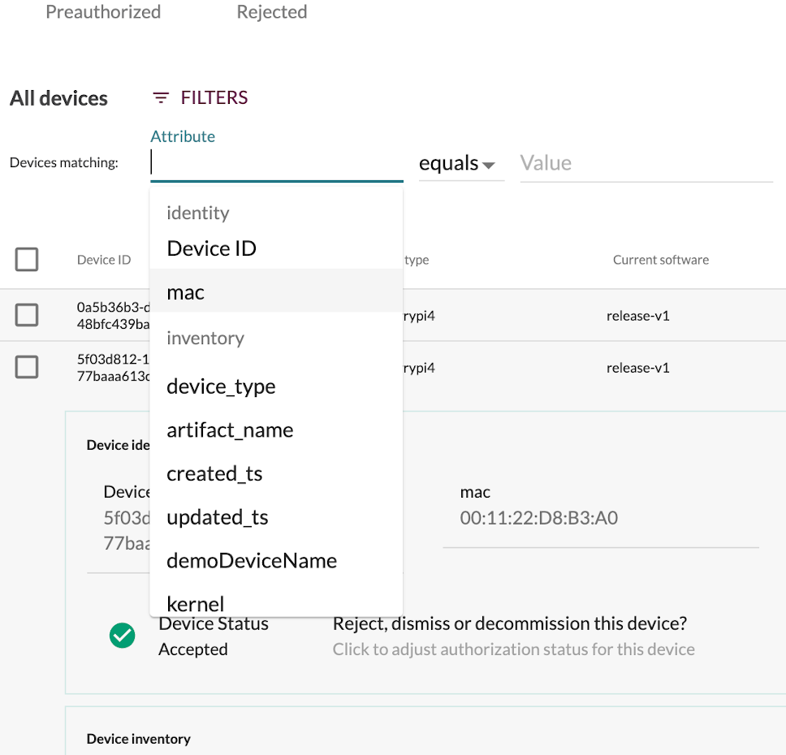

## Introduction to inventory attributes

When you log in to mender server UI and navigate to device list, among other items,
you can see certain pieces of data associated with each device. Those can be
a hostname, IP address, or any key-value pair you can think of. This section
explains what they are, where they come from, who sends them, when, and how,
as well as how to customize them.

Inventory is a set of data that is useful to know about a device, similar to
the [device identity attributes](../identity). The device inventory attributes
are not unique identifiers, they are just informational. As such, they do not
need to be unique for each device like the device identity attributes.

The Mender client will periodically collect inventory-related data for reporting
to the Mender server. Executable files, stored in a known location, will be invoked by the Mender client,
producing the inventory data as a set of key-value pairs.

## Purpose

The Mender server stores information about each device in a form of key-value pairs
called *attributes* grouped in *scopes*. The inventory attributes belong
to *inventory* scope which also denotes the ownership of data; device 
"owns" the inventory data in a sense that it can overwrite the attributes
 in inventory scope at will.

Some considerations while working with inventory attributes:
* Inventory attributes are _not_ unique identifiers of a device
* Inventory attributes are pieces of data associated with a device that will be
  sent to the server for use in API calls or for sorting, filtering and searching
  in the UI.
* The client sends the attributes at regular intervals
  (configured as [InventoryPollIntervalSeconds](../../client-configuration/configuration-file/configuration-options#inventorypollintervalseconds)).
* The server updates all attributes sent by the client.

The following screenshot shows an example set of inventory data in the expanded view
of a device.


## Inventory attribute scripts

By default, the Mender client sends the following attributes:

<!--AUTOVERSION: "client version | \"%\""/mender-->
| name | meaning | example value |
|:----:|:-------:|:-------------:|
| `device_type`  | type of the device | "raspberrypi4" |
| `artifact_name` | name of the currently installed artifact | "release-v1" |
| `mender_client_version` | client version | "2.2.0" |

Adding additional inventory fields, such as the kernel version or total available
memory, is easy to do and Mender supports it well. Then you can use inventory
fields to create custom filters and dynamic groups.



As you can see the existence of attributes gives you the possibility to
create advanced filters and dynamic groups. We can also recognize two scopes
"identity" and "inventory" which we already have mentioned above. You could use this
feature to create, for instance, "LinuxV4HighMemDevices" group.

<!--AUTOVERSION: "mender/blob/%/support"/mender-->
Let's assume that you really want to create such a group. Obviously we need the
information from the device about Linux kernel and total memory. In order to
deliver it, in a portable manner, to the server your best choice is to use 
inventory attribute scripts. The following listing shows an example of such script.
It gathers information on CPU model, total memory, and host name. You can get it
[here](https://github.com/mendersoftware/mender/blob/master/support/mender-inventory-hostinfo).

```
#!/bin/sh
#
# The example script collects information about current host
#

set -ue

LC_ALL=C
export LC_ALL

grep 'model name' /proc/cpuinfo | uniq | awk -F': ' '
     // { printf("cpu_model=%s\n", $2);}
'
echo "kernel=$(cat /proc/version)"

cat /proc/meminfo | awk '
/MemTotal/ {printf("mem_total_kB=%d\n", $2)}
'

echo "hostname=$(cat /etc/hostname)"
```

This example gathers data from the target system and prints it to standard output
in the format "attribute_name=attribute_value". You should store this script
in the `/usr/share/mender/inventory`
directory, giving it a name, e.g.: `mender-inventory-net.sh` and executable permissions:

```
chmod 700 /usr/share/mender/inventory/mender-inventory-net.sh
```

Please note that the existence of the name prefix "*mender_inventory-*" is not
accidental; it is in fact required, as described in the following subsections.

<!--AUTOVERSION: "mender/tree/%/support"/mender-->
You can find some more useful scripts in [https://github.com/mendersoftware/mender/support](https://github.com/mendersoftware/mender/tree/master/support) directory.

## Inventory attribute use cases

The inventory attributes mechanism allows you to publish to Mender server every
piece of data that is important for your usage and that can be expressed as
key-value pairs. Later you can use the attributes to create filters, dynamic groups,
and to search for devices.

Examples of the use cases
* Information related to installation of the device
  * Site information
  * Location information
  * Project information
  * Customer information
* IP address
  * useful if you have VPN connections enabled, this could be a way to look up local IP address on the VPN network

## Basic rules for inventory attributes gathering

Periodically, the client will run every executable file possessing `mender-inventory-` prefix
from `/usr/share/mender/inventory` directory. Then it parses each line read from
the standard output of the script according to the following format:

```
name0=value0\n
.
.
nameN=valueN\n
```
Then the client publishes the attributes via [device inventory service API calls](../../apis/open-source/device-apis/device-inventory#device-attributes-patch),
namely by issuing **PATCH** _/device/attributes_.

### Lists of values

Attributes appearing multiple times will have their values merged into a list.
The client merges attributes appearing multiple times.
For example, the following output from the inventory executable:

```
interface=eth0
ip_address_eth0=192.168.1.1
interface=wlan0
ip_address_wlan0=172.27.1.1
```

will lead to the following attributes:

```
interface = [eth0, wlan0]
ip_address_eth0 = 192.168.1.1
ip_address_wlan0 = 172.27.1.1
```

### Special characters

You cannot use literal new line character in attribute names or values.
To support new lines or other special characters, use URL-style encoding.
For instance, if you want to encode:
```
multilinekey=value1\nvalue0
```
you have to use:
```
multilinekey=value1%0Avalue0
```

## Final remarks
Inventory attributes do not identify a device in any manner let alone uniquely.
They are a feature to let you store extra information orderly and then access
it via UI, search, sort, and filter by.
