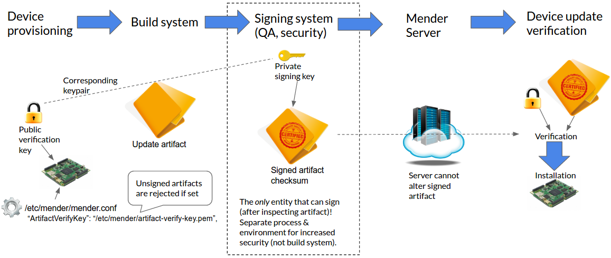

The goal for Mender is to provide a robust and secure software update process.
An important part of this is to give the Mender Client the ability to verify that the update comes from a trusted source.

One way of achieving this is to sign the Artifact using a protected private key, which is stored and used on a Signing system. The Mender Client can then verify it
using the corresponding public key. If the signature verification check passes, the update is considered to come from a trusted source.


## Signature management flow

The following diagram shows the high level flow of creating and managing keys and Artifact signatures, which are
the essential part of the Artifact signing and verification process.



The process begins with provisioning a device with the public verification key, and configuring the Mender Client
to use the key (with the `ArtifactVerifyKey` configuration option). After an image is built, it gets signed by the Signing system.

!!! Although it is convenient and possible to use the Build system as the Signing system, this lowers the security as unauthorized access to the private signing key is made easier for potential attackers (e.g. if the Build system is compromised). The best practice is to only sign Artifacts on some offline system, ideally as a manual operation after careful inspection of the Artifact.

After the Artifact is created and signed it can be uploaded to the Mender Server, where the Mender Client will download it from.
During the update installation process, the Mender Client will verify the Artifact using the corresponding public key that it was provisioned with.
The Artifact will only be installed if the verification is successful.
If Artifacts are not signed or the verification fails, the update process will be aborted and the Mender Client will report an error to the Mender Server.

! If the Mender Client is configured to enable signature verification (through the `ArtifactVerifyKey` option), it will reject any unsigned Artifacts. This is necessary because otherwise an attacker could simply inject unsigned Artifacts to bypass the signature verification.

## Supported signing algorithms

The following signing algorithms are supported by the Mender:
* RSA with recommended key length of at least 3072 bits
* ECDSA with curve P-256


## Generating keys

In order to sign and later on verify the signature of the Mender Artifact we need to generate a private and public key pair.
Please follow the respective section below, depending on the signature algorithm you want to use.

After generating the keys you will have a file `private.key`, which is only used by the Signing system, as well as
`public.key` which you [provision all the devices with](../building-for-production#artifact-signing-and-verification-keys).

!!! The file `public.key` is referred to as `artifact-verify-key.pem` when placed on the devices to avoid ambiguity with other keys.

#### RSA

Generating a private RSA key can be done by executing the command below:

```bash
openssl genpkey -algorithm RSA -out private.key -pkeyopt rsa_keygen_bits:3072
openssl rsa -in private.key -out private.key
```

To extract a public key from the private key use following command:

```bash
openssl rsa -in private.key -out public.key -pubout

```

#### ECDSA256

In order to generate a public and private ECDSA key pair use the commands below:

```bash
openssl ecparam -genkey -name prime256v1 -out private-and-params.key
openssl ec -in private-and-params.key -out private.key
openssl ec -in private-and-params.key -pubout -out public.key
```

The resulting `private.key` and `public.key` files are the private and public keys, respectively.


## Signing

Once a root file system for a device is built, use the `mender-artifact` tool to create a signed Artifact.
If you use Linux, [download the prebuilt mender-artifact binary][autoupdate_x.x.x_mender-artifact],
otherwise [compile it for your platform](../modifying-a-mender-artifact#compiling-mender-artifact).

[autoupdate_x.x.x_mender-artifact]: https://d1b0l86ne08fsf.cloudfront.net/mender-artifact/2.1.1/mender-artifact

To sign we use the `-k` parameter to specify the private key, which will be used for creating the signature.
The full command will look like the following:

```bash
mender-artifact write rootfs-image -t beaglebone -n mender-1.2.0 -u core-image-base-beaglebone.ext4 -k private.key -o artifact-signed.mender
```

This is the command the Signing system uses to create a signed Artifact.


## Verifying the signature

After a signed Artifact is created, it can be verified with `mender-artifact` as well. To verify the signature, again use the
`-k` option, but this time with the location of the *public verification key*.

```bash
mender-artifact read artifact-signed.mender -k public.key
```


## Enable Mender Client signature verification

To make it easier to provision your devices with the public verification key and corresponding Mender Client configuration,
Mender has integration with the Yocto Project. Please refer to the documentation for [Artifact signing and verification keys](../building-for-production#artifact-signing-and-verification-keys) to see how to include them.


