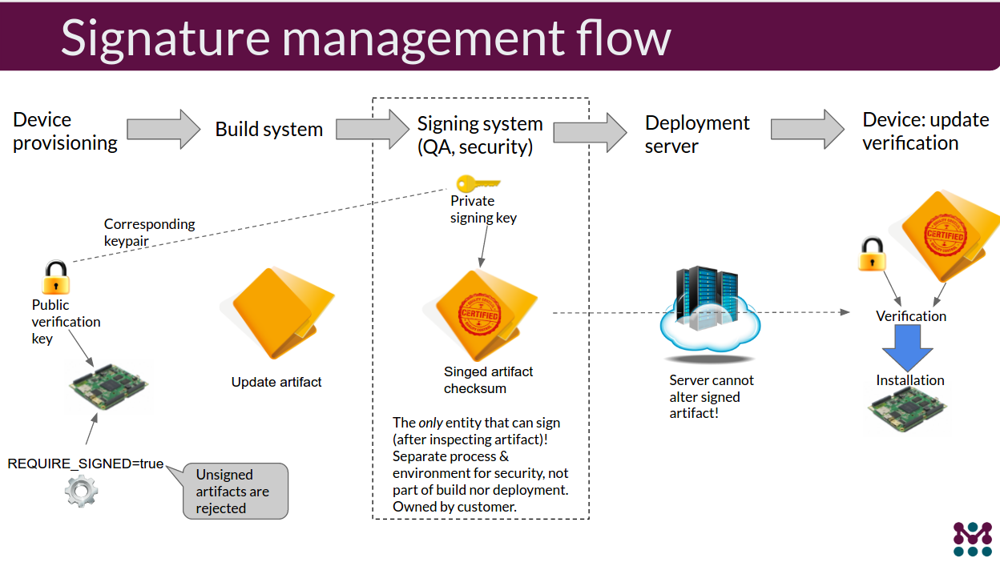

The aim of the Mender project is to provide a robust and secure process for updating software for connected devices.
An important part of the process is giving the Client the ability of verifying that the update comes from a known and trusted source.

One way of achieving it is to sign the Artifact using the protected private key, stored by the signing system. Then the Client can verify it
using appropriate public key. Only if the signature verification check is passing we can make sure that the update is coming from the credible source.


## Signature management flow

The following diagram shows the high level flow of creating and managing Artifact signatures and keys, which are
the essential part of Artifact signing and verification process.



The process begins with provisioning a device and building an Artifact for the given device to be updated. Once
an image is created it is signed by the signing system. Ideally to increase the security, the signing system should be
the only place where the access to the private signing key is granted, and it should be the only entity that can sign the Artifact.

After the Artifact is created and signed it can be uploaded to the deployment Server, where the Mender Client will download it from.
During the update installation process, the Mender Client will verify the Artifact using corresponding public key. Only if the verification
is successful the device will be updated.
In case of lack of signature, or verification failure the update process will be aborted and the Client will report an error to the Server.


## Supported signing algorithms

Following signing algorithms are supported by the Mender:
* RSA with recommended key length of at least 2048 bits
* ECDSA with curve P-256


## Generating keys

In order to sign and later on verify the signature of the Mender Artifact we need to generate a private and public key pair. Depending on the
signing algorithm chosen, to generate the keys please follow the instructions in the appropriate section below.

### RSA

Generating the private RSA key can be done executing the command below:

```bash
openssl genrsa -out priv.pem
```

To extract a public key from the private key, we have generated above, use following command:

```bash
openssl rsa -in priv.pem -out public.pem -pubout

```

### ECDSA256

In order to generate a public and private ECDSA key pair use the command below:

```bash
openssl ecparam -genkey -name secp256r1 -out priv.pem
openssl ec -in priv.pem -pubout -out public.pem
```


## Signing and verifying the image


Once the image for the given device is built we can use `mender-artifact` tool to create a signed Artifact. In order to so run the command below, providing
a `-k` parameter specifying private key, which will be used for creating the signature.

```bash
mender-artifact write rootfs-image -t beaglebone -n mender-1.0.1 -u image.ext4 -k priv.pem -o artifact-signed.mender
```

After the Artifact is created it can be verified or read and the additional signature verification check can be done. For verifying the signature, you can provide
`-k` command line option providing the location of the public verification key. Please note that even though we are using the same parameter as for the command above,
this time we are providing a public key, not the private one we've been using for creating a signed Artifact.

```bash
mender-artifact read artifact-signed.mender -k public.pem
```

